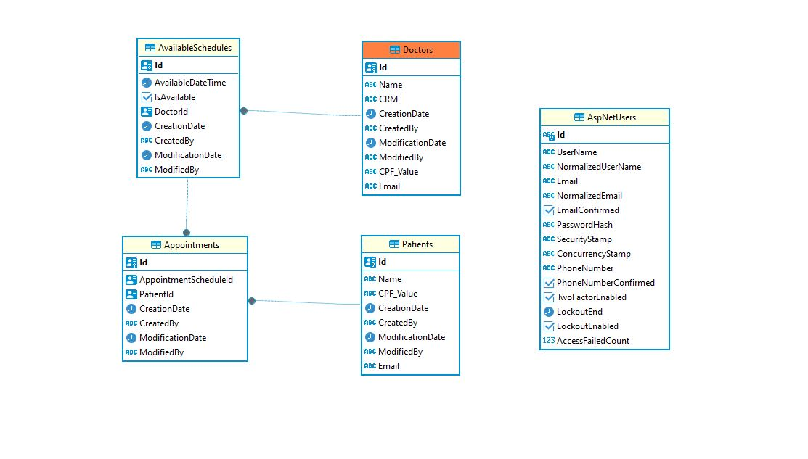

# Hackathon - Turma .NET
A Health&Med, é uma Operadora de Saúde que tem como objetivo digitalizar seus processos e operação. O principal gargalo da empresa é o Agendamento de
Consultas Médicas, que atualmente ocorre exclusivamente através de ligações para a central de atendimento da empresa.
Recentemente, a empresa recebeu um aporte e decidiu investir no
desenvolvimento de um sistema proprietário, visando proporcionar um processo
de Agendamentos de Consultas Médicas 100% digital e mais ágil.
Para viabilizar o desenvolvimento de um sistema que esteja em conformidade
com as melhores práticas de desenvolvimento, a Health&Med contratou os alunos
do curso de Pós Graduação .NET da FIAP para fazer a análise do projeto e
desenvolver o MVP da solução.
O objetivo do Hackathon é a entrega de um produto de MVP desenvolvido e que
cumpra os requisitos funcionais e não funcionais descritos abaixo.

## Requisitos Funcionais 

1. Cadastro do Usuário (Médico)
O médico deverá poder se cadastrar, preenchendo os campos
obrigatórios: Nome, CPF, Número CRM, E-mail e Senha.
2. Autenticação do Usuário (Médico)
Hackathon - Turma .NET 2
O sistema deve permitir que o médico faça login usando o E-mail e uma
Senha.
3. Cadastro/Edição de Horários Disponíveis (Médico)
O sistema deve permitir que o médico faça o Cadastro e Edição de seus
horários disponíveis para agendamento de consultas.
4. Cadastro do Usuário (Paciente)
O paciente poderá se cadastrar preenchendo os campos: Nome, CPF, Email
e Senha.
5. Autenticação do Usuário (Paciente)
O sistema deve permitir que o paciente faça login usando um E-mail e
Senha.
6. Busca por Médicos (Paciente)
O sistema deve permitir que o paciente visualize a listagem dos médicos
disponíveis.
7. Agendamento de Consultas (Paciente)
Após selecionar o médico, o paciente deve poder visualizar a agenda do
médico com os horários disponíveis e efetuar o agendamento.
8. Notificação de consulta marcada (Médico)
Após o agendamento, feito pelo usuário Paciente, o médico deverá
receber um e-mail contendo:
Título do e-mail:
”Health&Med - Nova consulta agendada”
Corpo do e-mail:
”Olá, Dr. {nome_do_médico}!
Você tem uma nova consulta marcada!
Paciente: {nome_do_paciente}.
Data e horário: {data} às {horário_agendado}.”

## Requisitos Não Funcionais
1. Concorrência de Agendamentos
O sistema deve ser capaz de suportar múltiplos acessos simultâneos e
garantir que apenas uma marcação de consulta seja permitida para um
determinado horário.
2. Validação de Conflito de Horários
O sistema deve validar a disponibilidade do horário selecionado em tempo
real, assegurando que não haja sobreposição de horários para consultas
agendadas.

## Vídeo Youtube

## Iniciando

Para acessar a aplicação hospedada no Azure acesse o  endereço https://fiap-hackathon-f7cyata0hnd5djat.eastus-01.azurewebsites.net/swagger/index.html

Para rodar local você deverá incluir sua connection string do banco de dados postgres. A aplicação execute o migration no startup

A aplicação envia e-mails. Você pode configurar um e-mail local utilizando a imagem do docker rnwood/smpt4dev

```bash
docker pull rnwood/smpt4dev
docker run --rm -d --name fakemail -p 3000:80 -p 2525:25 rnwood/smtp4dev

```


## Diagrama de banco de Dados



## API endpoints

- **/Login e Register**
  - `/login` realiza login. somente e-mail e senha.
  - `/register` cria uma conta de usuário. Somente e-mail e senha.

- **/Doctors**
  - `GET` Lista todos os doutores disponíveis no sistema.
  - `POST` Usuário logado cria seu cadastro como Doutor.

- **/Patients**
  - `GET` Lista todos os pacientes  disponíveis no sistema.
  - `POST` Usuário logado cria seu cadastro como Paciente.

- **/AvailableSchedules**
  - `GET` Lista todos os horários disponíveis de todos os doutores para agendamento. 
  - `POST` Usuário logado com cadastro de Doutor cria um horário na agenda.
  - `PUT` Usuário logado com cadastro de Doutor edita seu horário na agenda.

- **/Appointments**
  - `GET` Lista todos os agendamentos do usuário logado e cadastrado como paciente.
  - `POST` Agenda um horário disponível com um doutor.
